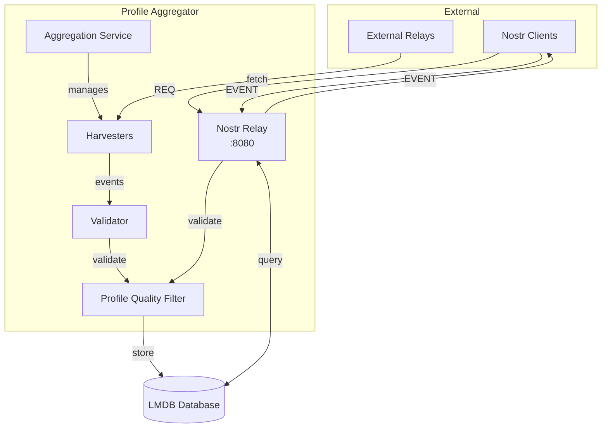

# Profile Aggregator

A Nostr relay that aggregates and filters user profiles from the network.

## Architecture



## How it Works

- **Aggregation Service**: Manages harvesting from external relays
  - Historical pagination + real-time subscriptions
  - Sequential processing to avoid rate limiting
  - Exponential backoff on failures
- **Nostr Relay**: Standard relay on port 8080
- **Profile Quality Filter**: Shared validation logic
  - Requires: name, bio, valid image (300x600px min)
  - Verifies: published text notes via outbox
  - Excludes: bridges, mostr accounts, ActivityPub fields

## Quick Start

```bash
# Docker
docker run -p 8080:8080 ghcr.io/verse-pbc/profile_aggregator:latest

# From source
cargo run --release
```

## Configuration

Key environment variables:

| Variable | Description | Default |
|----------|-------------|---------|
| `DISCOVERY_RELAY_URL` | Source relay for profiles | `wss://relay.nos.social` |
| `BIND_ADDR` | Server address | `0.0.0.0:8080` |
| `DATABASE_PATH` | Data storage | `/data/profile_aggregator.db` |
| `PAGE_SIZE` | Events per fetch | `500` |
| `RUST_LOG` | Log level | `profile_aggregator=info` |

## Development

```bash
# Install git hooks
./scripts/setup-hooks.sh

# Run tests
cargo test

# Build
cargo build --release
```

## API

- `ws://localhost:8080` - Nostr relay endpoint
- `http://localhost:8080/health` - Health check

## License

MIT