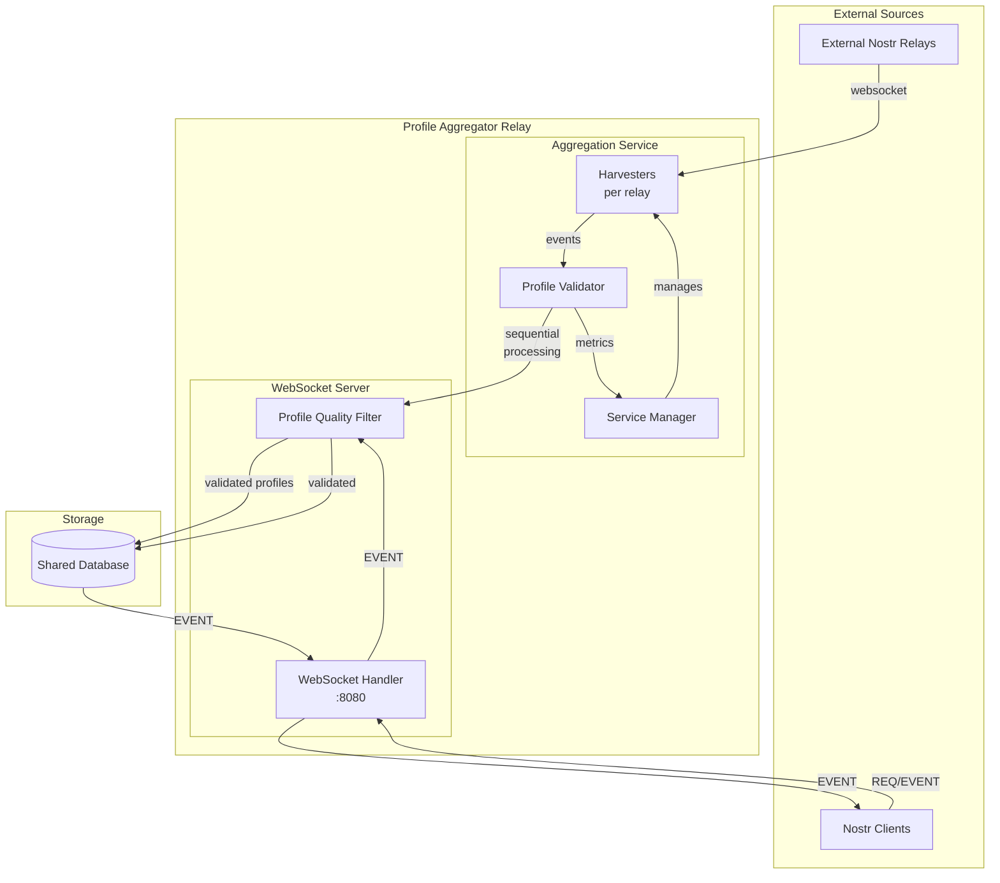

# Profile Aggregator

A Nostr relay that aggregates and filters user profiles from the network.

## Architecture



## How it Works

The Profile Aggregator operates as both a harvester and a Nostr relay:

### 1. **Aggregation Service** (harvests from external relays)
- **Harvesters** connect to each relay and run two parallel streams:
  - Historical: Fetches old events backward in time
  - Real-time: Monitors new events as they arrive
- **Validator** processes events sequentially:
  - No worker pool - single-threaded processing to minimize rate limiting
  - Automatic retry with exponential backoff for rate-limited requests
  - Validates profiles (quality, images, spam filtering)

### 2. **WebSocket Server** (acts as a Nostr relay)
- Listens on port 8080 for WebSocket connections
- Accepts EVENT messages from clients (new profiles)
- Runs incoming events through the same ProfileQualityFilter
- Stores validated events in the shared database
- Responds to REQ subscriptions with filtered profiles

### 3. **Profile Validation**
- Name: requires display_name or name field
- Bio: requires non-empty about field
- Picture: validates URL, checks image dimensions (min 300x600px)
- Verified: must have published text note via outbox relays
- Excludes: bridges, mostr accounts, profiles with fields array

## Quick Start

```bash
# Docker
docker run -p 8080:8080 ghcr.io/verse-pbc/profile_aggregator:latest

# From source
cargo run --release
```

## Configuration

Key environment variables:

| Variable | Description | Default |
|----------|-------------|---------|
| `DISCOVERY_RELAY_URL` | Source relay for profiles | `wss://relay.nos.social` |
| `BIND_ADDR` | Server address | `0.0.0.0:8080` |
| `DATABASE_PATH` | Data storage | `/data/profile_aggregator.db` |
| `PAGE_SIZE` | Events per fetch | `500` |
| `RUST_LOG` | Log level | `profile_aggregator=info` |

## Development

```bash
# Install git hooks
./scripts/setup-hooks.sh

# Run tests
cargo test

# Build
cargo build --release
```

## API

- `ws://localhost:8080` - Nostr relay endpoint
- `http://localhost:8080/health` - Health check

## License

MIT