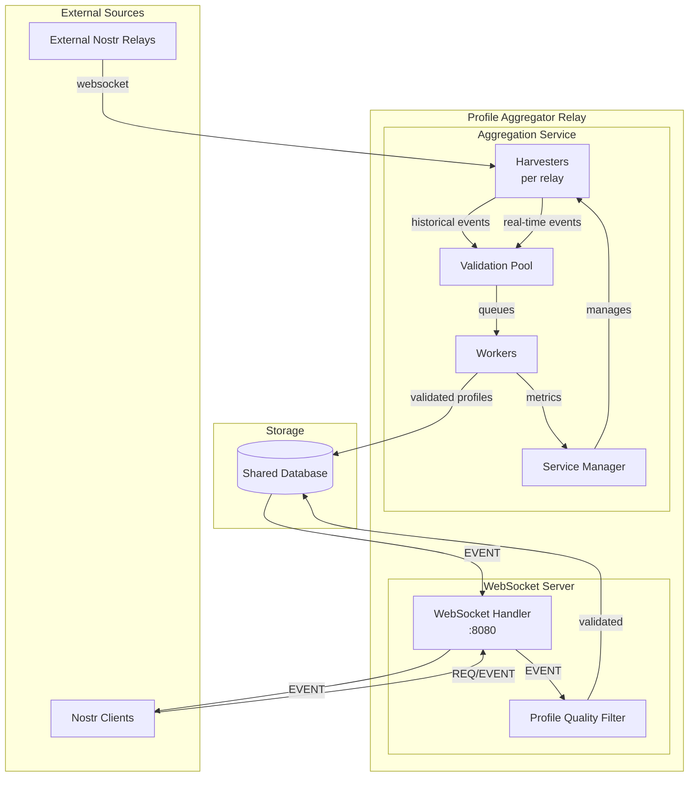

# Profile Aggregator Event Flow

## Architecture Overview

## How It Works

The Profile Aggregator operates as both a harvester AND a Nostr relay:

### 1. **Aggregation Service** (harvests from external relays)
- **Harvesters** connect to each relay and run two parallel streams:
  - Historical: Fetches old events backward in time
  - Real-time: Monitors new events as they arrive
- **Validation Pool** queues events for processing:
  - Immediate queue for new events
  - Delayed queue for rate-limited retries
- **Workers** validate profiles (quality, images, spam) and store results

### 2. **WebSocket Server** (acts as a Nostr relay)
- Listens on port 8080 for WebSocket connections
- Accepts EVENT messages from clients (new profiles)
- Runs incoming events through the same ProfileQualityFilter
- Stores validated events in the shared database
- Responds to REQ subscriptions with filtered profiles
- Implements NIP-01 (basic protocol) and NIP-11 (relay information)

### 3. **Shared Components**
- Both services use the same ProfileQualityFilter
- Both services write to the same database
- Metrics logged every 20 seconds show accepted/rejected/failed counts