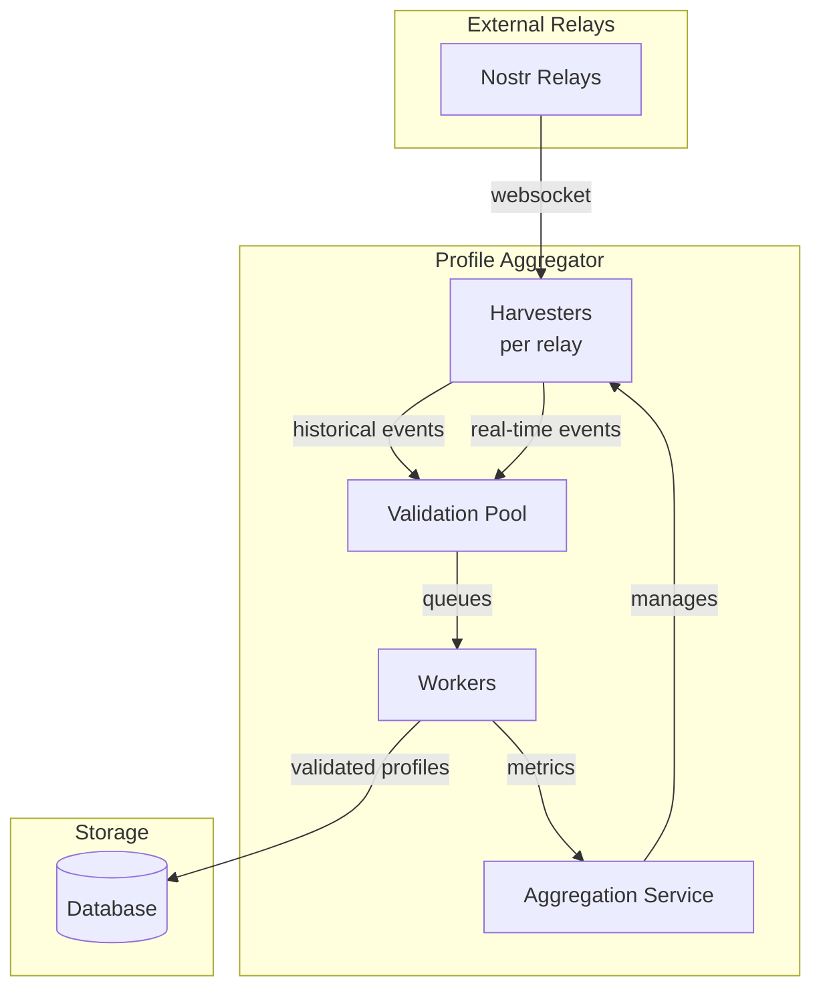

# Profile Aggregator Event Flow

## Architecture Overview

## How It Works

1. **Harvesters** connect to each relay and run two parallel streams:
   - Historical: Fetches old events backward in time
   - Real-time: Monitors new events as they arrive

2. **Validation Pool** queues events for processing:
   - Immediate queue for new events
   - Delayed queue for rate-limited retries

3. **Workers** validate profiles (quality, images, spam) and store results

4. **Metrics** logged every 60 seconds show accepted/rejected/failed counts